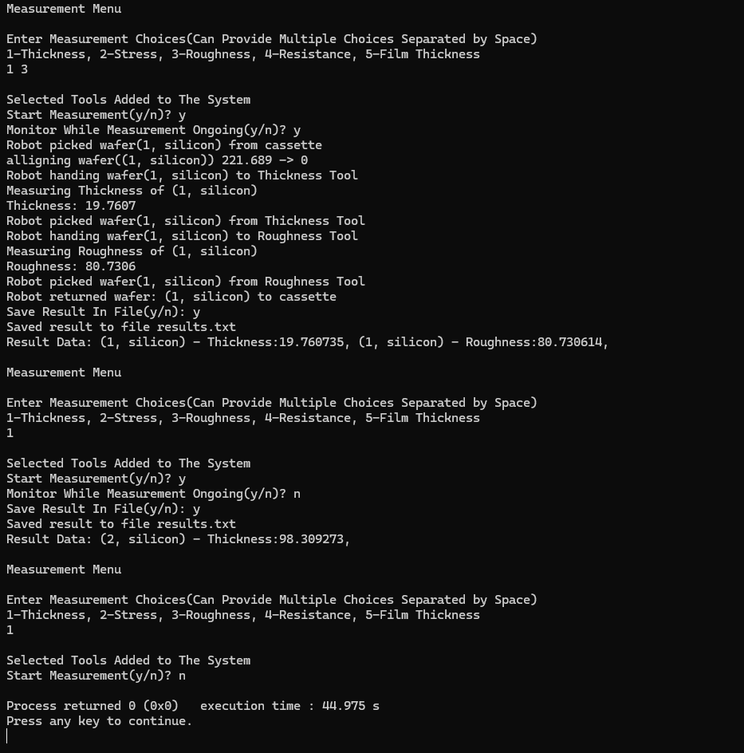

# Wafer-Measurement-Automation-Process
<h2>Object Oriented approach in C++ to implement wafer measurement automation process</h1> 
<h3>Process Summarry:</h3>  
<b>1. </b> Cassette stores Wafer objects privately using a queue-like container (deque) to maintain FIFO wafer processing and enforce encapsulation.  

<b>2. </b>RobotArm is declared as a friend class of Cassette, allowing controlled access to retrieve wafers from the front of the cassette. 

<b>3. </b>RobotArm holds one wafer at a time, simulating real semiconductor wafer-handling robots. 

<b>4. </b>RobotArm picks a wafer from the front of the cassette and becomes the temporary owner of the wafer object while transporting it between system components. 

<b>5. </b>The wafer is transferred to the first user-selected MeasurementTool. 

<b>6. </b>MeasurementTool is implemented as an abstract base class providing a common interface (measure()). 

<b>7. </b>Specific tools (ThicknessTool, RoughnessTool, ResistanceTool, FilmThicknessTool, StressTool) inherit from MeasurementTool. 

<b>8. </b>Each derived tool overrides measure() to perform its specific measurement on the wafer. 

<b>9. </b>Tools are stored in MeasurementManager using smart pointers: 

<code>vector<std::unique_ptr<MeasurementTool>></code> 

Using std::unique_ptr ensures automatic memory management and prevents memory leaks. 

<b>10. </b>Because tools are stored as base-class pointers, calling tool->measure(wafer) enables runtime polymorphism.

<b>11. </b>After all selected measurements are completed, results are optionally saved to a file, and RobotArm returns the wafer to the back of the cassette before processing the next wafer. 

<h3>Output:</h3> 

